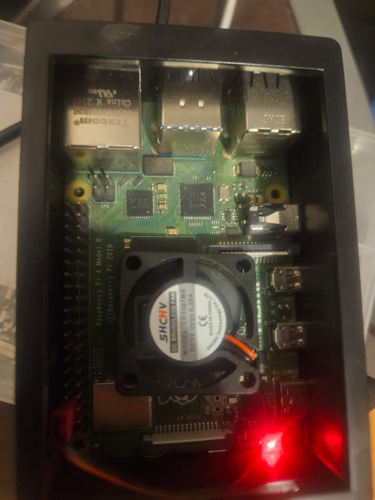
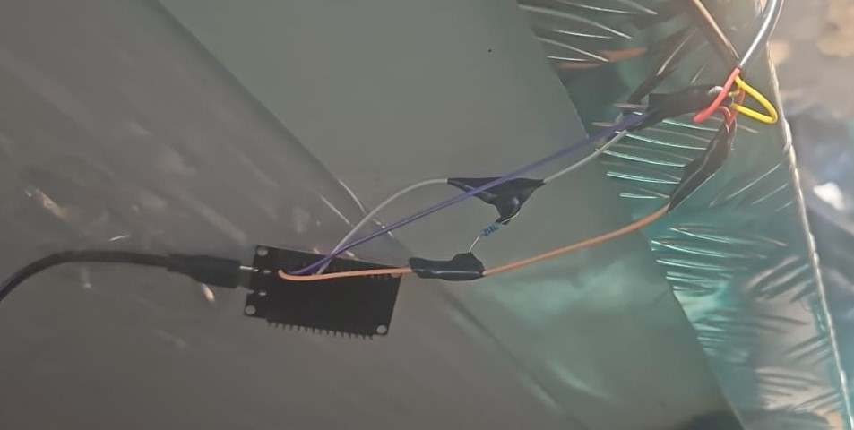

# IoT Temperature System V2: De Excel a la base de datos

> **"Donde hay una limitación técnica, hay una oportunidad de optimización"**

## Visión del Proyecto
Este proyecto nace de la convergencia entre mi experiencia previa en monitoreo térmico y lo aprendido en la **Pipeline de Extracción de Datos (Sector Machas)**. 

La problemática principal es la proyección a futuro del volumen de datos: capturar 1,440 celdas diarias es sencillo; gestionarlas durante un año es el verdadero reto. Aunque la solución fácil sería espaciar las lecturas, optamos por otro camino: migrar los datos a una base de datos profesional. 

A diferencia de proyectos anteriores, la infraestructura ya no depende de un PC convencional. Dado que los datos se suben con alta frecuencia, si el PC se apaga, se pierde esa continuidad. Para solucionar esto, utilicé mi experiencia con **Raspberry Pi** y **Docker** para crear un servidor de bajo consumo que garantiza la disponibilidad de los datos 24/7.

---

## Herramientas Utilizadas
* **Hardware:** Raspberry Pi 4 (4GB RAM), ESP32 y sensores del proyecto pasado.
* **Infraestructura:** Docker (para contenedores aislados y persistentes).
* **Orquestación:** n8n (flujo de automatización vía Webhooks).
* **Base de Datos:** PostgreSQL.
* **Visualización:** Grafana.

---

## Estructura del Repositorio

### code_raspberry

En este apartado se detalla la preparación de la unidad central del sistema:

* **Instalación del Sistema Operativo:** Uso de la plataforma oficial Raspberry Pi Imager y configuración inicial del sistema (no está explicado).
* **Control Remoto:** Habilitación de VNC para controlar la Raspberry Pi mediante RealVNC Viewer, permitiendo una gestión visual constante de los procesos (no está explicado, hay videos y generalmente se hace por SSH, yo me acostumbré a VNC por temas de gusto).
* **Infraestructura Docker:** Despliegue del ecosistema mediante un archivo en la carpeta `iot_project` que gestiona los contenedores de n8n, Grafana y PostgreSQL de forma simultánea.

### n8n y n8n_produccion

Documentación de la lógica y el flujo de datos:

* **n8n Test:** Configuración inicial accesible a través de localhost para crear secciones de prueba y validar el ingreso de datos a la base de datos.
* **n8n producción:** Implementación del flujo final, realización del *publish* y optimización del código para asegurar un flujo de datos real y continuo.

### code_esp32

Contiene los programas desarrollados para el microcontrolador:

* **Modo Prueba:** Código base para validar que el sensor captura y envía datos correctamente a la infraestructura.
* **Modo Producción:** Código definitivo para el funcionamiento continuo y estable en el entorno real.

### grafana

Guía sobre la visualización y análisis de las métricas:

* **Conexión:** Pasos para vincular la base de datos PostgreSQL con el panel de Grafana.
* **Análisis de Datos:** Configuración de gráficos principales con tres marcas de referencia:
    * **Marca en 0 grados:** Para monitorear con qué frecuencia se sobrepasa esta marca.
    * **Marca en 5 grados:** Establecida como umbral de alerta.
    * **Marca en 30 grados:** Para el seguimiento de la temperatura exterior.

### img e img_grafana
* **img:** Contiene capturas de pantalla detalladas para hacer más visual el proceso de configuración de n8n,ademas de fotos del hardware.
* **img_grafana:** Incluye imágenes del tablero final de control y ejemplos de las configuraciones.

## Notas de Mantenimiento
Se menciona que la Raspberry Pi permanece encendida las 24 horas del día para garantizar el monitoreo constante. Por esta razón, se recomienda el uso de una carcasa con ventilador o sistema de disipación para proteger el hardware.

---

## Impacto del Proyecto

* **Eficiencia Energética:** Reducción drástica del consumo eléctrico al migrar la carga de trabajo de un PC convencional a una **Raspberry Pi 4**.
* **Integridad de Datos:** Disponibilidad 24/7 que elimina los "huecos" de información en las gráficas, asegurando una base de datos continua.
* **Capacidad de Análisis:** Transición exitosa de datos planos a una base de datos relacional robusta.

---

## Conclusión

> **"Es importante saber cuáles son las limitantes de cada proyecto para saber cómo mejorarlas en el futuro."**

La mejora de este proyecto permite alargar la supervisión de la cámara de frío, facilitando análisis comparativos entre estaciones. La práctica de combinar Docker, Raspberry Pi y bases de datos es una combinación poderosa para bajar el consumo energético y mantener activa la base de datos. Con el tiempo, se podrán sumar más sensores e ir transformando el entorno en una **industria inteligente**.

```
[ ENTORNO FÍSICO ]             [ SERVIDOR RASPBERRY PI (DOCKER) ]           [ VISUALIZACIÓN ]
  
    Sensor Temp/Hum                 n8n Webhook (ETL)                    Grafana Dashboard
          |                                |                                     ^
          v                                v                                     |
    ESP32 / Python       ------>    PostgreSQL DB      -----------------------+
   (Lectura 1 min)             (Persistencia 24/7)               (Análisis de Tendencias)
